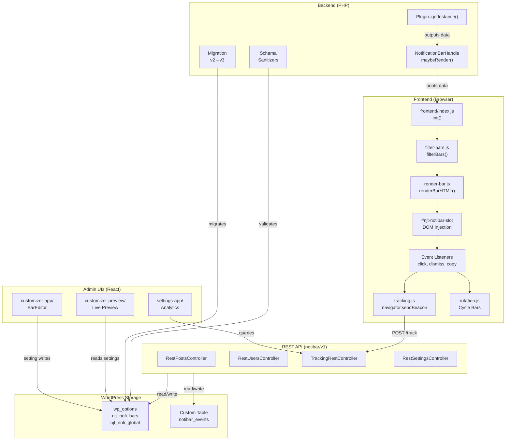
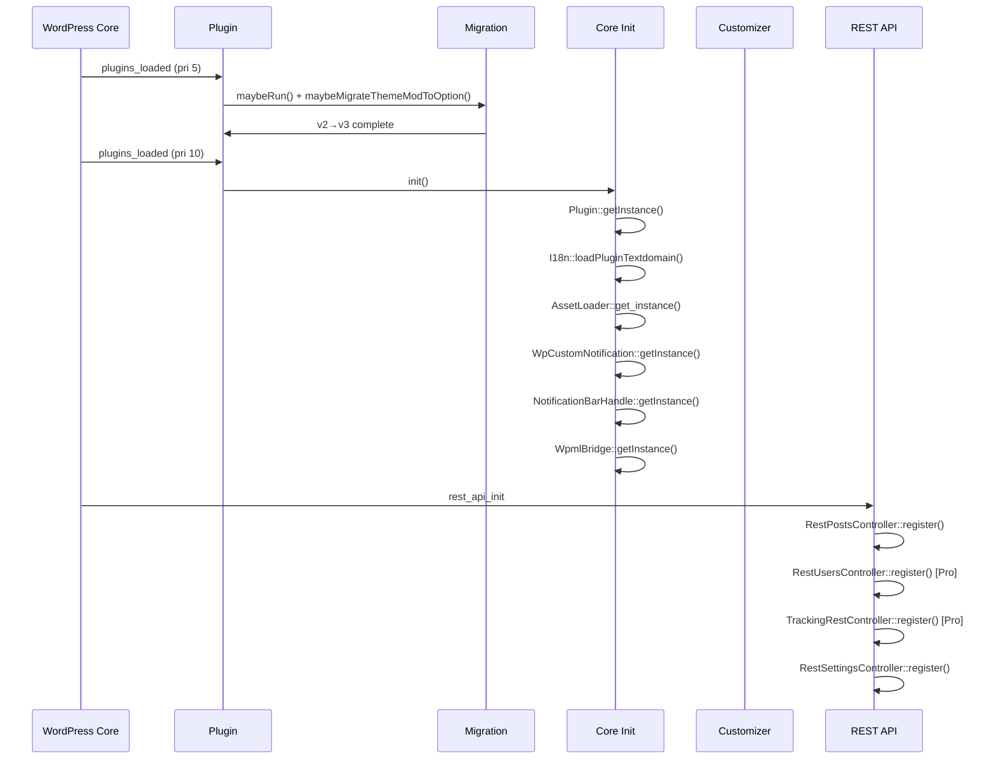
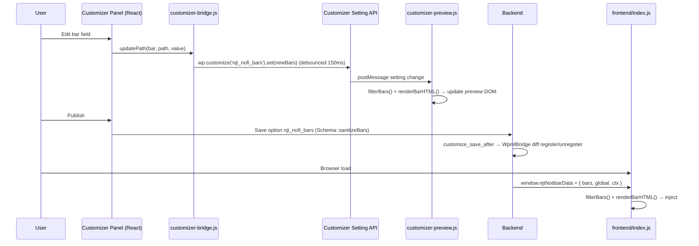

# Architecture — Diagrams & Cross-Cutting Concerns

Part of [system-architecture.md](../system-architecture.md).

## System Architecture Diagram

## Bootstrap Sequence

## Data Flow: Bar Edit → Save → Render

---

## Performance Characteristics

Qualitative design intent (no benchmark targets are committed in the repo):

| Layer | Characteristic |
|-------|----------------|
| Plugin load | Custom PSR-4 autoloader; REST routes only on `rest_api_init`; frontend assets gated by `shouldRender()`. |
| Frontend render | Dependency-free vanilla JS; filter + render run synchronously on inlined data, no extra HTTP. |
| Analytics bundle | `TrackingCharts` (Chart.js) lazy-loaded only when the Tracking tab opens; charts code-split out of the main bundle. |
| Tracking beacon | `navigator.sendBeacon` — non-blocking, survives navigation. |
| Rotation | CSS keyframe animations; respects `prefers-reduced-motion`. |
| Body push | `ResizeObserver` — fires only on slot size change. |
| REST search | Paginated (`per_page`/`page`), with `hasMore` cursoring. |

## Security

| Layer | Mechanism | Details |
|-------|-----------|---------|
| Input | Sanitization | `wp_kses_post` (HTML text), `sanitize_hex_color` (colors), `intval` + clamp (numbers), enum whitelists, custom `sanitizeIdList` (IDs) |
| Output | Escaping | `esc_html` / `esc_attr` (PHP); `escapeAttr` / `escapeText` (JS); `wp_json_encode` for boot data |
| REST auth | Capability | `edit_theme_options` (Customizer search), `manage_options` (settings, stats) |
| REST nonce | `@wordpress/api-fetch` includes the WP REST nonce automatically |
| `/track` | Anon by design | No nonce/auth (beacon); validated by `bar_id` regex + existence check |
| Storage | Multisite-safe | `wp_options` (not theme_mods) since v3.1.2 |
| Tracking | No PII | Stores only `is_logged_in` boolean; no IP / user_id / email; no external calls |
